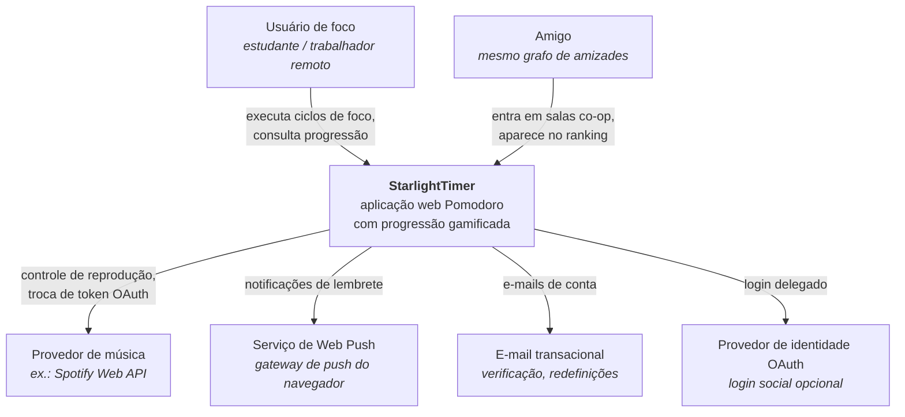
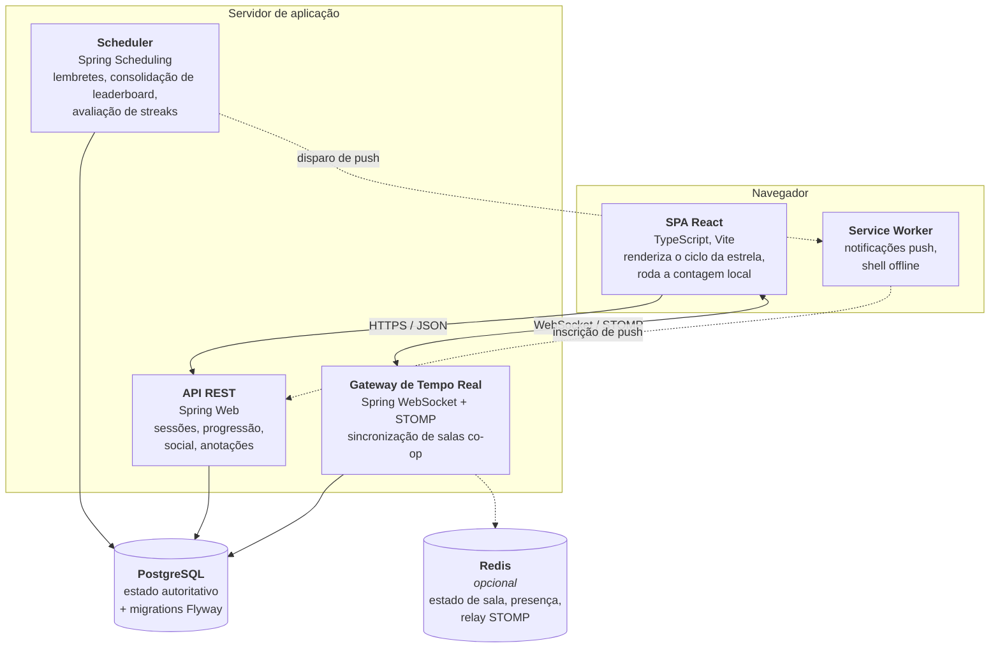
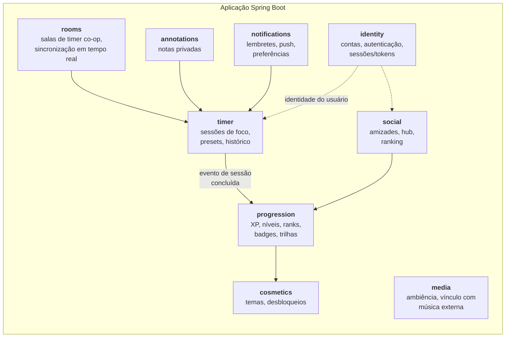
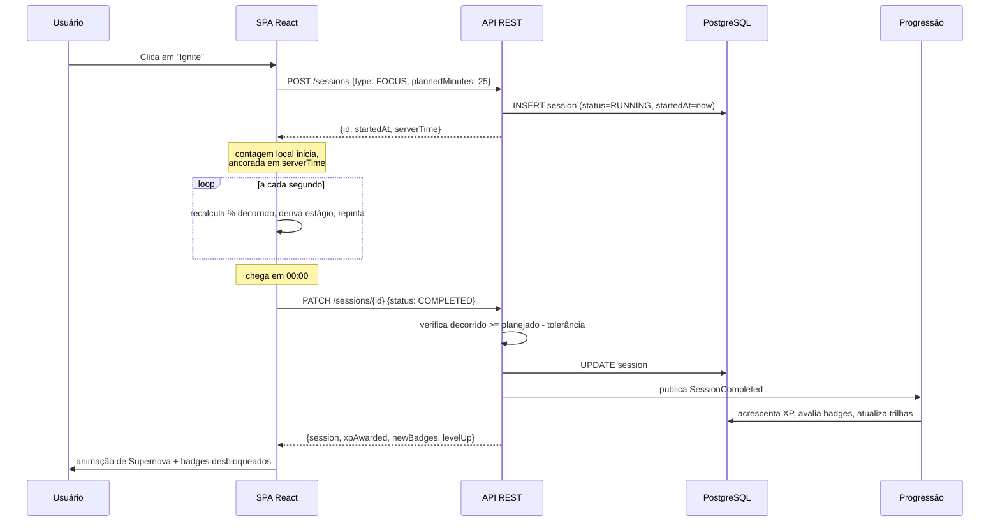
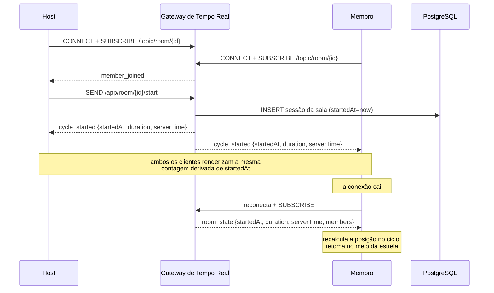

# 02 — Arquitetura

Visão de nível macro de como o StarlightTimer é montado e por quê. Detalhes de implementação vivem no código e nos READMEs de cada módulo.

## Objetivos e restrições

**Objetivos**
- Uma única unidade implantável pelo maior tempo possível. O time é pequeno e o perfil de tráfego é modesto.
- Fronteiras internas claras, de modo que um módulo possa ser extraído depois sem arqueologia.
- O schema é a fonte da verdade (database-first), e o código se conforma a ele.
- A complexidade cognitiva permanece baixa. Abstrações são introduzidas quando um segundo caso concreto aparece, não em antecipação a um.

**Restrições**
- Backend em Java + Spring Boot, frontend em TypeScript + React, PostgreSQL.
- A precisão do timer importa, porque ciclos concluídos alimentam um ranking competitivo. O sistema não pode confiar na palavra do cliente sobre o tempo decorrido.
- Salas co-op exigem comunicação bidirecional em tempo real, que é um modelo de interação diferente do resto do app.

## Contexto do sistema



Toda dependência externa acima, exceto e-mail transacional, é opcional para o MVP. Mantê-las opcionais é deliberado: nenhuma delas deve estar no caminho crítico de iniciar um timer.

## Containers



**O Redis está marcado como opcional e deve permanecer assim até que uma necessidade concreta apareça.** Ele só se torna necessário quando você roda mais de uma instância da aplicação e as salas co-op precisam atravessar instâncias, ou quando as atualizações de presença ficam pesadas demais para o banco. Deploy de instância única com estado de sala em memória é o ponto de partida correto.

## Mapa de módulos do backend

Um **monólito modular**: uma aplicação Spring Boot, empacotada por feature, com módulos se comunicando através de interfaces publicadas em vez de alcançar as entranhas uns dos outros.



Layout de pacotes sugerido:

```
com.starlighttimer
├── identity/
│   ├── api/          ← controllers + DTOs (superfície pública)
│   ├── domain/       ← entidades + regras de negócio
│   ├── persistence/  ← repositórios
│   └── IdentityFacade.java   ← o único tipo que outros módulos podem importar
├── timer/
├── progression/
├── social/
├── rooms/
├── annotations/
├── notifications/
├── media/
├── cosmetics/
└── shared/           ← transversal: tratamento de erros, clock, config, filtros de segurança
```

Duas regras mantêm isso honesto:

1. **Um módulo só pode importar a facade de outro módulo.** Nunca suas entidades, repositórios ou serviços internos.
2. **`shared` não pode importar nenhum módulo de feature.** Se algo em `shared` precisa de conhecimento de domínio, esse algo pertence a um módulo de feature.

Se essas duas regras se mantiverem, extrair qualquer módulo para um serviço próprio depois é uma refatoração mecânica, e não uma reescrita.

## Decisões-chave e trade-offs

### AD-1 — Monólito modular, não microsserviços

Vocês mencionaram querer "princípios de micro-arquitetura, mas apenas quando claramente necessário". Concretamente: adote as *fronteiras* dos microsserviços e nada da *distribuição*.

| | Monólito modular (escolhido) | Microsserviços |
|---|---|---|
| Deploy | Um artefato, um pipeline | N artefatos, N pipelines |
| Transações | ACID local entre features | Sagas, consistência eventual |
| Depuração | Um stack trace | Tracing distribuído obrigatório |
| Custo de uma fronteira errada | Mover um pacote | Migração de rede + migração de dados |
| Overhead de time | Baixo | Alto para um time pequeno |

As features com maior probabilidade de precisar de escala independente são salas co-op e notificações. Ambas já estão isoladas como módulos, então, se a carga algum dia justificar, elas são as candidatas à extração.

**Revisitar quando:** o time passar de aproximadamente oito pessoas de engenharia, ou o perfil de recursos do gateway de tempo real divergir fortemente do da API REST.

### AD-2 — Tempo autoritativo no servidor, renderização no cliente

O cliente roda uma contagem regressiva com `setInterval` para ter visual suave (como o protótipo já faz). O servidor registra timestamps de forma independente e é o único juiz de se um ciclo foi concluído.

```
Cliente: renderiza 25:00 → 00:00 suavemente, atualiza o estágio da estrela
Servidor: armazena startedAt; ao concluir, verifica
          (now - startedAt) >= plannedDuration - tolerância
```

Isso importa porque ciclos concluídos produzem XP, que produz ranking. Um "terminei!" reportado puramente pelo cliente é trivialmente forjável por qualquer pessoa com um console de navegador. Dado que o ranking é apenas entre amigos e de baixo risco, o objetivo não é anti-cheat hermético — é fazer com que trapacear casualmente exija esforço deliberado em vez de curiosidade.

**Trade-off:** o servidor precisa tolerar desvio de relógio, latência de rede e abas legitimamente em segundo plano (navegadores limitam timers em abas inativas, então cliente e servidor *vão* divergir). Uma janela de tolerância de alguns segundos, mais reconciliação contra os timestamps do servidor na reconexão, resolve isso. As especificidades estão em aberto — veja **D-3** no checklist.

### AD-3 — Sessões são registros, não objetos em voo

Uma sessão de foco é escrita no banco quando ela *começa*, não quando termina.

```
POST /sessions        → cria a linha: status=RUNNING, startedAt=now
PATCH /sessions/{id}  → status=PAUSED | RUNNING | COMPLETED | ABANDONED
```

É isso que faz "fechar a aba e voltar" funcionar, que torna possível continuar em múltiplos dispositivos e que dá à sala co-op algo concreto contra o que sincronizar. Também significa que sessões abandonadas são dados visíveis em vez de silêncio, o que é útil tanto para o histórico do usuário quanto para análise de produto.

**Trade-off:** você acumula linhas de sessões que ninguém terminou, e precisa de um job agendado para marcar sessões `RUNNING` muito antigas como `ABANDONED`.

### AD-4 — Database-first, garantido por migrations

Database-first com Spring Boot tem um modo de falha específico que vale nomear logo de cara: `spring.jpa.hibernate.ddl-auto` configurado com qualquer coisa diferente de `validate` silenciosamente torna as *entidades* a fonte da verdade, que é o oposto do que vocês querem.

O fluxo:

```
1. O time projeta / revisa o diagrama ER
2. Escreve à mão uma migration Flyway (V__x.sql) implementando a mudança
3. A migration roda no startup e na CI
4. As entidades JPA são escritas para casar com o schema, com ddl-auto: validate
5. A aplicação se recusa a subir se entidades e schema discordarem
```

`validate` transforma divergência de schema de uma surpresa em produção em uma falha de startup na máquina de um dev.

### AD-5 — Progressão é orientada a eventos dentro do monólito

Quando uma sessão é concluída, o módulo `timer` publica um evento de domínio. O módulo `progression` escuta e concede XP, avalia badges e atualiza trilhas.

```
timer.SessionCompleted → progression.onSessionCompleted()
                             ├── concede XP (escreve em xp_ledger)
                             ├── recalcula nível e rank
                             ├── avalia critérios de badges
                             └── atualiza trilhas de progressão
```

Use o `ApplicationEventPublisher` do Spring com `@TransactionalEventListener`. Sem message broker, sem infraestrutura. A razão de usar eventos em vez de uma chamada direta é que os critérios de badges vão crescer — cada badge novo é uma nova regra de listener, e vocês não querem que o módulo timer saiba sobre badges.

**Trade-off:** eventos in-process são invisíveis em stack traces e fáceis de perder de vista. Mantenha poucos e nomeados a partir de fatos de negócio (`SessionCompleted`, `FriendshipAccepted`), nunca de operações técnicas.

### AD-6 — XP como um ledger append-only

Armazene concessões individuais de XP como linhas, não como um total acumulado no usuário.

| Abordagem | Recalcular histórico | Mostrar "de onde veio meu XP" | Corrigir um bug na fórmula |
|---|---|---|---|
| Coluna contador | Impossível | Impossível | O dado fica permanentemente errado |
| Ledger (escolhido) | Reprocessar | Consultar o ledger | Reprocessar com a nova fórmula |

Faça cache do total na linha do usuário se o carregamento do perfil ficar lento, mas trate o ledger como a verdade.

## Fluxos de dados principais

### Sessão de foco solo



Note que o cliente ancora sua contagem em `serverTime`, não no próprio relógio. Isso não custa nada e elimina uma categoria inteira de relatos de bug vindos de usuários com relógio de sistema desajustado.

### Sala co-op (pós-MVP)



A propriedade importante: o servidor transmite um **timestamp de início e uma duração**, nunca um tick ou um valor de segundos restantes. Os clientes derivam a própria contagem a partir desses dois valores. Isso torna o protocolo quase gratuito (um punhado de mensagens por sessão, em vez de uma por segundo) e torna a reconexão trivialmente correta — um cliente que volta calcula exatamente a mesma posição que todo mundo.

## Preocupações transversais

| Preocupação | Abordagem | Dono |
|---|---|---|
| Autenticação | Spring Security; estratégia de token indefinida (**A-1**) | `identity` |
| Autorização | Visibilidade apenas entre amigos aplicada na camada de serviço, nunca só na UI | cada módulo |
| Formato de erro | Um único formato problem-detail RFC 9457 em todos os endpoints | `shared` |
| Tempo | Injete um bean `Clock` em todo lugar; nunca chame `Instant.now()` diretamente — é isso que torna a lógica de progressão testável | `shared` |
| Fusos horários | Armazene em UTC; zona IANA do usuário no perfil; streaks avaliados no dia local do usuário (**D-6**) | `shared` |
| Validação | Bean Validation nos DTOs, invariantes nos objetos de domínio | cada módulo |
| Observabilidade | Spring Boot Actuator + logs estruturados em JSON; tracing adiado | `shared` |
| Migrations | Flyway, versionadas, somente para frente | `shared` |

## O que deliberadamente *não* está decidido aqui

Hospedagem, provedor de CI, layout do repositório, esquema de versionamento de API, biblioteca de gerenciamento de estado e escolhas de framework de teste estão todos em aberto. Eles são rastreados no [05 — Checklist de Planejamento](05-planning-checklist.md) em vez de serem antecipados aqui, porque dependem mais da preferência do time e do orçamento do que da arquitetura.
