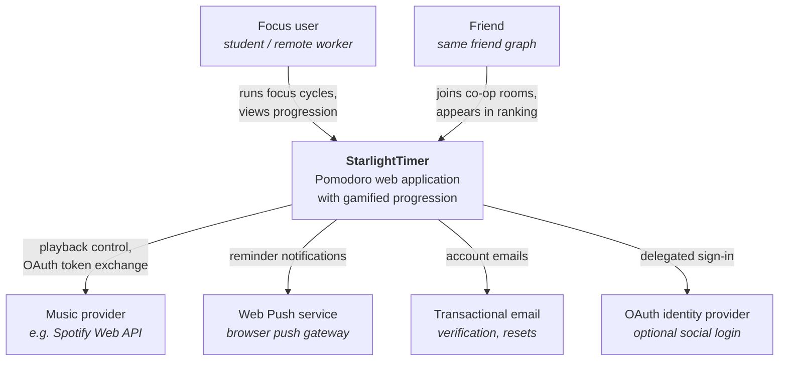
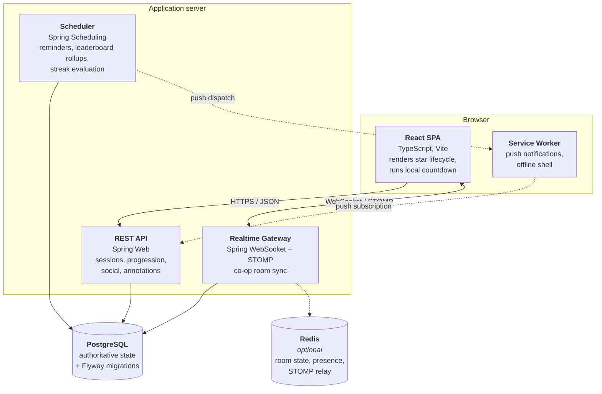
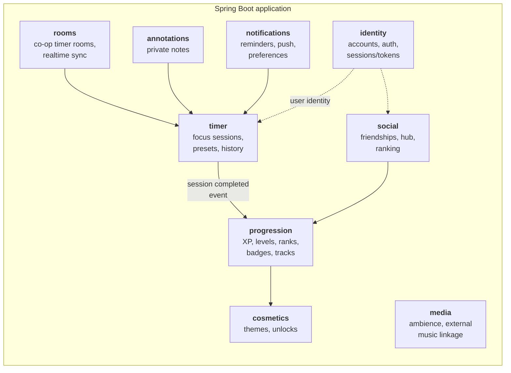
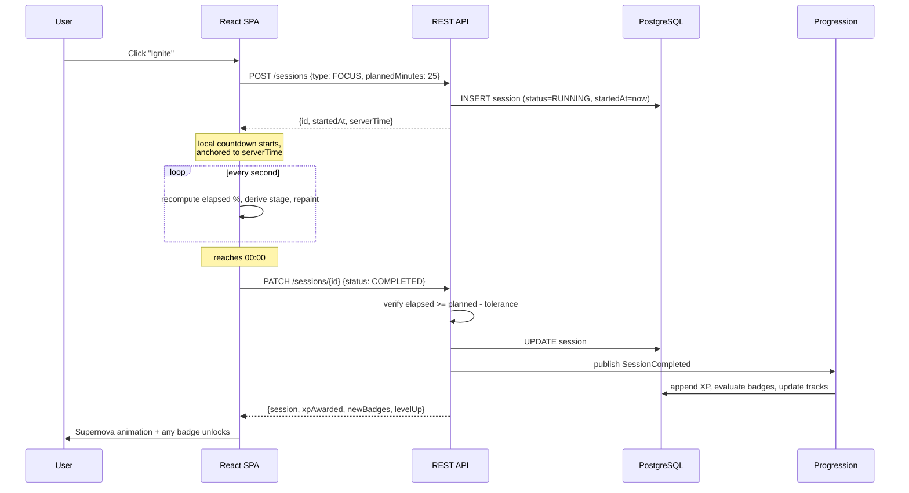

# 02 — Architecture

Macro-level view of how StarlightTimer is put together and why. Implementation detail lives in code and in per-module READMEs.

## Goals and constraints

**Goals**
- One deployable unit for as long as possible. The team is small and the traffic profile is modest.
- Clear internal boundaries so that a module could be extracted later without archaeology.
- Schema is the source of truth (database-first), and the code conforms to it.
- Cognitive complexity stays low. Abstractions are introduced when a second concrete case appears, not in anticipation of one.

**Constraints**
- Java + Spring Boot backend, TypeScript + React frontend, PostgreSQL.
- Timer accuracy matters, because completed cycles feed a competitive ranking. The system cannot trust the client's word about elapsed time.
- Co-op rooms require real-time bidirectional communication, which is a different interaction model from the rest of the app.

## System context



Every external dependency above except transactional email is optional for the MVP. Keeping them optional is deliberate: none of them should sit on the critical path of starting a timer.

## Containers



**Redis is marked optional and should stay that way until a concrete need appears.** It becomes necessary only when you run more than one application instance and co-op rooms must span instances, or when presence updates become too chatty for the database. Single-instance deployment with in-memory room state is the correct starting point.

## Backend module map

A **modular monolith**: one Spring Boot application, packaged by feature, with modules communicating through published interfaces rather than reaching into each other's internals.



Suggested package layout:

```
com.starlighttimer
├── identity/
│   ├── api/          ← controllers + DTOs (public surface)
│   ├── domain/       ← entities + business rules
│   ├── persistence/  ← repositories
│   └── IdentityFacade.java   ← the only type other modules may import
├── timer/
├── progression/
├── social/
├── rooms/
├── annotations/
├── notifications/
├── media/
├── cosmetics/
└── shared/           ← cross-cutting: error handling, clock, config, security filters
```

Two rules keep this honest:

1. **A module may only import another module's facade.** Never its entities, repositories, or internal services.
2. **`shared` may not import any feature module.** If something in `shared` needs domain knowledge, it belongs in a feature module instead.

If those two rules hold, extracting any module into its own service later is a mechanical refactor rather than a rewrite.

## Key decisions and trade-offs

### AD-1 — Modular monolith, not microservices

You mentioned wanting "micro-architecture principles, but only when clearly necessary." Concretely: adopt the *boundaries* of microservices and none of the *distribution*.

| | Modular monolith (chosen) | Microservices |
|---|---|---|
| Deployment | One artifact, one pipeline | N artifacts, N pipelines |
| Transactions | Local ACID across features | Sagas, eventual consistency |
| Debugging | One stack trace | Distributed tracing required |
| Cost of a wrong boundary | Move a package | Network migration + data migration |
| Team overhead | Low | High for a small team |

The features most likely to need independent scaling are co-op rooms and notifications. Both are already isolated as modules, so if load ever justifies it, they are the extraction candidates.

**Revisit when:** you have more than roughly eight engineers, or the realtime gateway's resource profile diverges sharply from the REST API's.

### AD-2 — Server-authoritative timing, client-side rendering

The client runs a `setInterval` countdown for smooth visuals (as the prototype already does). The server independently records timestamps and is the sole judge of whether a cycle completed.

```
Client:  renders 25:00 → 00:00 smoothly, updates star stage
Server:  stores startedAt; on completion, verifies
         (now - startedAt) >= plannedDuration - tolerance
```

This matters because completed cycles produce XP, which produces ranking. A purely client-reported "I finished!" is trivially forged by anyone with a browser console. Given that ranking is friends-only and low-stakes, the goal is not airtight anti-cheat — it's making casual cheating require deliberate effort rather than curiosity.

**Trade-off:** the server must tolerate clock skew, network delay, and legitimately backgrounded tabs (browsers throttle timers in inactive tabs, so client and server *will* drift). A tolerance window of a few seconds, plus reconciling against server timestamps on reconnect, handles this. Specifics are open — see checklist **D-3**.

### AD-3 — Sessions are records, not in-flight objects

A focus session is written to the database when it *starts*, not when it ends.

```
POST /sessions        → creates row: status=RUNNING, startedAt=now
PATCH /sessions/{id}  → status=PAUSED | RUNNING | COMPLETED | ABANDONED
```

This is what makes "close the tab and come back" work, makes multi-device continuation possible, and gives the co-op room something concrete to synchronise against. It also means abandoned sessions are visible data rather than silence, which is useful for both the user's history and for product analytics.

**Trade-off:** you accumulate rows for sessions nobody finished, and you need a scheduled job to mark long-stale `RUNNING` sessions as `ABANDONED`.

### AD-4 — Database-first, enforced through migrations

Database-first with Spring Boot has one specific failure mode worth naming up front: `spring.jpa.hibernate.ddl-auto` set to anything other than `validate` silently makes the *entities* the source of truth, which is the opposite of what you want.

The workflow:

```
1. Team designs / revises the ER diagram
2. Hand-write a Flyway migration (V__x.sql) implementing the change
3. Migration runs on startup and in CI
4. JPA entities are written to match, with ddl-auto: validate
5. Application refuses to boot if entities and schema disagree
```

`validate` turns schema drift from a production surprise into a startup failure on a developer's machine.

### AD-5 — Progression is event-driven inside the monolith

When a session completes, the `timer` module publishes a domain event. The `progression` module listens and awards XP, evaluates badges, and updates tracks.

```
timer.SessionCompleted → progression.onSessionCompleted()
                             ├── award XP (write to xp_ledger)
                             ├── recompute level & rank
                             ├── evaluate badge criteria
                             └── update progression tracks
```

Use Spring's `ApplicationEventPublisher` with `@TransactionalEventListener`. No message broker, no infrastructure. The reason to bother with events at all rather than a direct call is that badge criteria will grow — every new badge is a new listener rule, and you don't want the timer module to know about badges.

**Trade-off:** in-process events are invisible in stack traces and easy to lose track of. Keep them few and named after business facts (`SessionCompleted`, `FriendshipAccepted`), never after technical operations.

### AD-6 — XP as an append-only ledger

Store individual XP awards as rows, not a running total on the user.

| Approach | Recompute history | Show "where did my XP come from" | Fix a bug in the formula |
|---|---|---|---|
| Counter column | Impossible | Impossible | Data is permanently wrong |
| Ledger (chosen) | Replay | Query the ledger | Replay with new formula |

Cache the total on the user row for read performance if profile loads get slow, but treat the ledger as truth.

## Core data flows

### Solo focus session



Note that the client anchors its countdown to `serverTime`, not to its own clock. This costs nothing and eliminates an entire category of bug reports from users with skewed system clocks.

### Co-op room (post-MVP)


The important property: the server broadcasts a **start timestamp and a duration**, never a tick or a remaining-seconds value. Clients derive their own countdown from those two values. This makes the protocol nearly free (a handful of messages per session rather than one per second) and makes reconnection trivially correct — a rejoining client computes exactly the same position as everyone else.

## Cross-cutting concerns

| Concern | Approach | Owner |
|---|---|---|
| Authentication | Spring Security; token strategy undecided (**A-1**) | `identity` |
| Authorisation | Friends-only visibility enforced in service layer, never in the UI alone | each module |
| Error format | Single RFC 9457 problem-detail shape across all endpoints | `shared` |
| Time | Inject a `Clock` bean everywhere; never call `Instant.now()` directly — this is what makes progression logic testable | `shared` |
| Time zones | Store UTC; user's IANA zone on the profile; streaks evaluated in the user's local day (**D-6**) | `shared` |
| Validation | Bean Validation on DTOs, invariants in domain objects | each module |
| Observability | Spring Boot Actuator + structured JSON logs; tracing deferred | `shared` |
| Migrations | Flyway, versioned, forward-only | `shared` |

## What is deliberately *not* decided here

Hosting, CI provider, repository layout, API versioning scheme, state management library, and testing framework choices are all open. They're tracked in [05 — Planning Checklist](05-planning-checklist.md) rather than pre-empted here, because they depend on team preference and budget more than on architecture.
