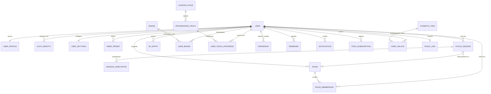

# 03 — Modelo de Domínio

Insumo para a sessão de brainstorming de entidades do time. Este é um **mapa candidato**, não um diagrama ER finalizado — ele existe para que a sessão comece a partir de uma crítica, e não de uma página em branco.

## Mapa de entidades candidatas



## Notas sobre as entidades

Apenas as entidades com uma questão de design não óbvia associada. Tabelas de lookup triviais foram omitidas.

### `USER` / `USER_PROFILE` / `AUTH_IDENTITY`

Separadas de propósito. `USER` guarda identidade e ciclo de vida (id, e-mail, status, created_at, deleted_at). `USER_PROFILE` guarda questões de exibição (nome de exibição, avatar, fuso horário, bio). `AUTH_IDENTITY` guarda uma linha por método de login, de forma que adicionar login com Google depois não exija reestruturação.

Manter hashes de senha fora de `USER_PROFILE` importa mais do que parece: dados de perfil são retornados para amigos, e uma tabela que você nunca faz join em uma query visível a amigos é uma tabela que você não consegue vazar por acidente.

### `FOCUS_SESSION`

A tabela central. Todo o resto é ou configuração para ela, ou consequência dela.

Campos que valem uma discussão na sessão:

- `type` — `FOCUS` / `SHORT_BREAK` / `LONG_BREAK`. Pausas devem viver na mesma tabela que ciclos de foco? Recomendação: sim. Elas compartilham todos os campos, e "me mostre meu dia" vira uma única query ordenada em vez de um merge.
- `status` — `RUNNING` / `PAUSED` / `COMPLETED` / `ABANDONED`. Conforme **AD-3**, a linha existe desde o momento em que a sessão começa.
- `planned_duration_seconds` vs `actual_focus_seconds` — vocês precisam dos dois. O planejado dirige o ciclo de vida da estrela e a verificação de conclusão; o real (planejado menos o tempo de pausa acumulado) dirige estatísticas honestas.
- `paused_total_seconds` — tempo de pausa acumulado. Mais simples que uma tabela separada de intervalos de pausa, e suficiente a menos que vocês queiram mostrar *quando* a pessoa pausou.
- `room_id` — FK anulável. Uma sessão co-op é uma sessão comum que por acaso referencia uma sala.
- `started_at` / `ended_at` — `timestamptz`, sempre em UTC.

**Questão em aberto:** uma sessão que ficou pausada por duas horas e depois foi concluída é uma estrela legítima? Veja **D-2**.

### `SESSION_ANNOTATION`

"Anotações privadas" precisa ter seu modelo de privacidade definido antes do schema. Três leituras possíveis:

1. *Privada* = não compartilhada com amigos. Autorização comum a nível de linha. Simples.
2. *Privada* = não legível pelos operadores. Exige criptografia em nível de aplicação com chave derivada do usuário, o que então quebra busca e torna a redefinição de senha destrutiva.
3. *Privada* = um tipo de nota distinto ao lado de futuras notas compartilhadas. Exige uma coluna de visibilidade desde já.

A leitura 1 é quase certamente o que se quer dizer, mas confirmem (**D-8**) — adaptar para a leitura 2 depois é caro.

Também vale decidir: anotações são presas estritamente a uma sessão, ou podem ser notas diárias soltas? Um `session_id` anulável mais um `note_date` cobre os dois casos, ao custo de um modelo um pouco mais confuso.

### `XP_ENTRY`

Ledger append-only conforme **AD-6**. Uma linha por concessão: `user_id`, `amount`, `source_type` (`SESSION_COMPLETED`, `STREAK_BONUS`, `BADGE_UNLOCKED`, `COOP_BONUS`), `source_id`, `awarded_at`.

Nível e rank são **derivados** da soma do ledger, não armazenados como valores autoritativos. Faça cache deles em `USER_PROFILE` se as queries de perfil ficarem lentas, mas o ledger permanece a fonte da verdade.

### `BADGE` / `USER_BADGE`

`BADGE` é um catálogo: código, nome, descrição, definição visual e um descritor de critério. `USER_BADGE` registra desbloqueios e, para badges cumulativos, o progresso atual (o protótipo mostra "Deep Field · 12 / 25").

A verdadeira questão de design é **como os critérios são expressos**:

| Opção | Custo | Flexibilidade |
|---|---|---|
| Uma classe Java por badge | Badge novo = deploy | Total |
| Critério em JSON + avaliador genérico | Badge novo = insert de dado | Limitada aos predicados modelados |
| Híbrido: JSON para badges de contagem, código para os exóticos | Moderado | Boa |

O híbrido costuma ser o certo. A maioria dos badges é "faça X, N vezes" e quer ser dado. Alguns poucos ("Night Watch" — sessões depois da meia-noite) querem ser código. Não construam o avaliador genérico até ter pelo menos três badges que o usariam.

### `FRIENDSHIP`

Linha direcional (`requester_id`, `addressee_id`, `status`, `responded_at`) com leitura simétrica.

Duas constraints poupam dor depois: um índice único no par ordenado, e um check de que `requester_id <> addressee_id`. Decidam se `BLOCKED` vive nessa tabela ou em uma tabela `USER_BLOCK` separada — separada é mais limpo, porque um bloqueio deve sobreviver à exclusão da amizade.

### `ROOM` / `ROOM_MEMBERSHIP`

`ROOM` precisa de: host, nome, status (`LOBBY` / `ACTIVE` / `CLOSED`), referência ao ciclo atual, capacidade e um mecanismo de convite. `ROOM_MEMBERSHIP` precisa de: joined_at, left_at e papel.

As perguntas difíceis são comportamentais, e não estruturais, e todas estão sem resposta — veja **R-1** a **R-5**. Não projetem essa tabela até que estejam resolvidas; as respostas mudam o formato dela.

### `PROGRESSION_TRACK` / `CONSTELLATION`

O protótipo mostra quatro trilhas ("Main sequence hours", "Constellation completed", "Weekly focus goal", "Break discipline"). Duas delas são cumulativas vitalícias e duas são periódicas (semanais). Essa distinção exige uma coluna `period` e um job de reset, ou então as trilhas periódicas precisam ser calculadas na leitura a partir da tabela de sessões em vez de armazenadas. **Calcular na leitura é mais simples e provavelmente correto nesta escala** — uma meta semanal é um `COUNT(*)` com filtro de data.

Considerem se `PROGRESSION_TRACK` precisa existir como tabela no MVP, ou se é um catálogo fixo em código.

### `MUSIC_LINK`

Se streaming externo for usado, esta tabela guarda o refresh token OAuth do provedor. Isso a torna a tabela mais sensível do schema depois das credenciais: criptografem a coluna do token em repouso, nunca a registrem em log, nunca a retornem ao cliente, e façam com que a exclusão de conta revogue o token no provedor em vez de apenas apagar a linha.

## Convenções de modelagem a combinar

Definam isso uma vez, antes da primeira migration, para que o schema permaneça uniforme:

| Questão | Recomendação | Justificativa |
|---|---|---|
| Chaves primárias | `BIGINT GENERATED ALWAYS AS IDENTITY`, mais um id público `UUID` nas entidades expostas ao usuário | Ids sequenciais são eficientes internamente; expô-los revela a contagem de usuários e permite enumeração |
| Timestamps | `timestamptz`, sempre em UTC | Ambiguidade aqui é irrecuperável depois |
| Enums | `VARCHAR` + constraint `CHECK`, não `ENUM` do Postgres | Enums do Postgres são dolorosos de alterar |
| Soft delete | Apenas em `USER`; hard delete no resto | Soft delete em tudo significa que toda query precisa de um filtro, e um filtro esquecido é um vazamento de dados |
| Nomenclatura | `snake_case`, tabelas no plural, sufixo `_id` em FKs | Consistência acima de preferência |
| Dinheiro/duração | Durações em segundos como `INTEGER` | Evita surpresas de aritmética com intervalos |

## Pontos de partida para indexação

As queries que vão dominar:

```sql
-- Histórico de sessões e painel "hoje"
CREATE INDEX ON focus_session (user_id, started_at DESC);

-- Job de limpeza de sessões RUNNING travadas
CREATE INDEX ON focus_session (status, started_at) WHERE status = 'RUNNING';

-- Ranking de amigos: soma de XP por usuário em um período
CREATE INDEX ON xp_entry (user_id, awarded_at DESC);

-- Busca simétrica de amizade
CREATE INDEX ON friendship (addressee_id, status);
CREATE INDEX ON friendship (requester_id, status);
```

Adicionem esses índices quando a query correspondente existir, não antes. Meçam com `EXPLAIN ANALYZE` sobre volumes de dados realistas em vez de supor.

## Perguntas para a sessão de brainstorming

Levem estas para a mesa:

1. Pausas pertencem a `FOCUS_SESSION` ou a uma tabela separada?
2. Uma anotação está presa a uma sessão, a uma data, ou a qualquer um dos dois?
3. Trilhas de progressão são dado ou código no MVP?
4. O ranking de amigos usa XP vitalício, XP periódico, ou uma pontuação separada?
5. Qual é o menor conjunto de tabelas que sustenta o limite de MVP do doc 01? Construam esse conjunto e deixem o resto apenas no diagrama até a feature ser agendada.
