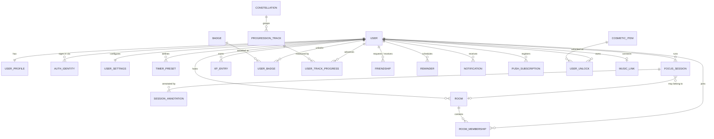

# 03 — Domain Model

Input for the team's entity brainstorming session. This is a **candidate map**, not a finished ER diagram — it exists so the session starts from a critique rather than a blank page.

## Candidate entity map



## Entity notes

Only the entities with a non-obvious design question attached. Straightforward lookup tables are omitted.

### `USER` / `USER_PROFILE` / `AUTH_IDENTITY`

Split deliberately. `USER` holds identity and lifecycle (id, email, status, created_at, deleted_at). `USER_PROFILE` holds display concerns (display name, avatar, timezone, bio). `AUTH_IDENTITY` holds one row per sign-in method, so adding Google login later doesn't require restructuring.

Keeping password hashes out of `USER_PROFILE` matters more than it looks: profile data gets returned to friends, and a table you never join into a friend-visible query is a table you can't accidentally leak.

### `FOCUS_SESSION`

The central table. Everything else is either configuration for it or a consequence of it.

Fields worth arguing about in the session:

- `type` — `FOCUS` / `SHORT_BREAK` / `LONG_BREAK`. Should breaks live in the same table as focus cycles? Recommendation: yes. They share every field, and "show me my day" becomes a single ordered query instead of a merge.
- `status` — `RUNNING` / `PAUSED` / `COMPLETED` / `ABANDONED`. Per **AD-3**, the row exists from the moment the session starts.
- `planned_duration_seconds` vs `actual_focus_seconds` — you need both. Planned drives the star lifecycle and the completion check; actual (planned minus accumulated pause time) drives honest statistics.
- `paused_total_seconds` — accumulated pause time. Simpler than a separate pause-interval table, and sufficient unless you want to show *when* someone paused.
- `room_id` — nullable FK. A co-op session is an ordinary session that happens to reference a room.
- `started_at` / `ended_at` — `timestamptz`, always UTC.

**Open question:** is a session that was paused for two hours and then completed a legitimate star? See **D-2**.

### `SESSION_ANNOTATION`

"Private annotations" needs its privacy model pinned down before schema. Three readings:

1. *Private* = not shared with friends. Ordinary row-level authorisation. Simple.
2. *Private* = not readable by operators. Requires application-level encryption with a user-derived key, which then breaks search and makes password reset destructive.
3. *Private* = a distinct note type alongside future shared notes. Needs a visibility column now.

Reading 1 is almost certainly what's meant, but confirm it (**D-8**) — retrofitting reading 2 is expensive.

Also worth deciding: are annotations attached strictly to a session, or can they be free-floating daily notes? A nullable `session_id` plus a `note_date` covers both, at the cost of a slightly muddier model.

### `XP_ENTRY`

Append-only ledger per **AD-6**. One row per award: `user_id`, `amount`, `source_type` (`SESSION_COMPLETED`, `STREAK_BONUS`, `BADGE_UNLOCKED`, `COOP_BONUS`), `source_id`, `awarded_at`.

Level and rank are **derived** from the ledger sum, not stored as authoritative values. Cache them on `USER_PROFILE` if profile queries get slow, but the ledger stays the source of truth.

### `BADGE` / `USER_BADGE`

`BADGE` is a catalogue: code, name, description, visual definition, and a criteria descriptor. `USER_BADGE` records unlocks and, for cumulative badges, current progress (the prototype shows "Deep Field · 12 / 25").

The real design question is **how criteria are expressed**:

| Option | Cost | Flexibility |
|---|---|---|
| Java class per badge | New badge = deploy | Full |
| JSON criteria + generic evaluator | New badge = data insert | Limited to modelled predicates |
| Hybrid: JSON for counting badges, code for exotic ones | Moderate | Good |

The hybrid is usually right. Most badges are "do X, N times" and want to be data. A few ("Night Watch" — sessions after midnight) want code. Don't build the generic evaluator until you have at least three badges that would use it.

### `FRIENDSHIP`

Directional row (`requester_id`, `addressee_id`, `status`, `responded_at`) with a symmetric read.

Two constraints save pain later: a unique index on the ordered pair, and a check that `requester_id <> addressee_id`. Decide whether `BLOCKED` lives in this table or a separate `USER_BLOCK` table — separate is cleaner, because a block should survive the friendship being deleted.

### `ROOM` / `ROOM_MEMBERSHIP`

`ROOM` needs: host, name, status (`LOBBY` / `ACTIVE` / `CLOSED`), current cycle reference, capacity, and an invite mechanism. `ROOM_MEMBERSHIP` needs: joined_at, left_at, and role.

The hard questions are behavioural rather than structural, and all of them are unanswered — see **R-1** through **R-5**. Don't design this table until they're settled; the answers change the shape.

### `PROGRESSION_TRACK` / `CONSTELLATION`

The prototype shows four tracks ("Main sequence hours", "Constellation completed", "Weekly focus goal", "Break discipline"). Two of those are lifetime cumulative and two are periodic (weekly). That distinction needs a `period` column and a reset job, or periodic tracks need to be computed on read from the session table instead of stored. **Computing on read is simpler and probably correct at this scale** — a weekly goal is one `COUNT(*)` with a date filter.

Consider whether `PROGRESSION_TRACK` needs to exist as a table at all in MVP, or whether it's a hard-coded catalogue in code.

### `MUSIC_LINK`

If external streaming is used, this holds the OAuth refresh token for the provider. That makes it the most sensitive table in the schema after credentials: encrypt the token column at rest, never log it, never return it to the client, and make account deletion revoke it upstream rather than just dropping the row.

## Modelling conventions to agree on

Settle these once, before the first migration, so the schema stays uniform:

| Question | Recommendation | Rationale |
|---|---|---|
| Primary keys | `BIGINT GENERATED ALWAYS AS IDENTITY`, plus a `UUID` public id on user-facing entities | Sequential ids are efficient internally; exposing them leaks user counts and enables enumeration |
| Timestamps | `timestamptz`, always UTC | Ambiguity here is unrecoverable later |
| Enums | `VARCHAR` + `CHECK` constraint, not Postgres `ENUM` | Postgres enums are painful to alter |
| Soft delete | Only on `USER`; hard delete elsewhere | Soft delete everywhere means every query needs a filter, and one forgotten filter is a data leak |
| Naming | `snake_case`, plural tables, `_id` suffix on FKs | Consistency over preference |
| Money/duration | Durations in seconds as `INTEGER` | Avoids interval arithmetic surprises |

## Indexing starting points

The queries that will dominate:

```sql
-- Session history and "today" panel
CREATE INDEX ON focus_session (user_id, started_at DESC);

-- Stale RUNNING session cleanup job
CREATE INDEX ON focus_session (status, started_at) WHERE status = 'RUNNING';

-- Friend ranking: sum XP per user in a period
CREATE INDEX ON xp_entry (user_id, awarded_at DESC);

-- Friendship symmetric lookup
CREATE INDEX ON friendship (addressee_id, status);
CREATE INDEX ON friendship (requester_id, status);
```

Add these when the corresponding query exists, not before. Measure with `EXPLAIN ANALYZE` on realistic data volumes rather than assuming.

## Questions for the brainstorming session

Bring these to the table:

1. Do breaks belong in `FOCUS_SESSION` or a separate table?
2. Is an annotation bound to a session, to a date, or to either?
3. Are progression tracks data or code in the MVP?
4. Does the friend ranking use lifetime XP, periodic XP, or a separate score entirely?
5. What is the smallest set of tables that supports the MVP boundary in doc 01? Build that, and leave the rest as diagram-only until the feature is scheduled.
