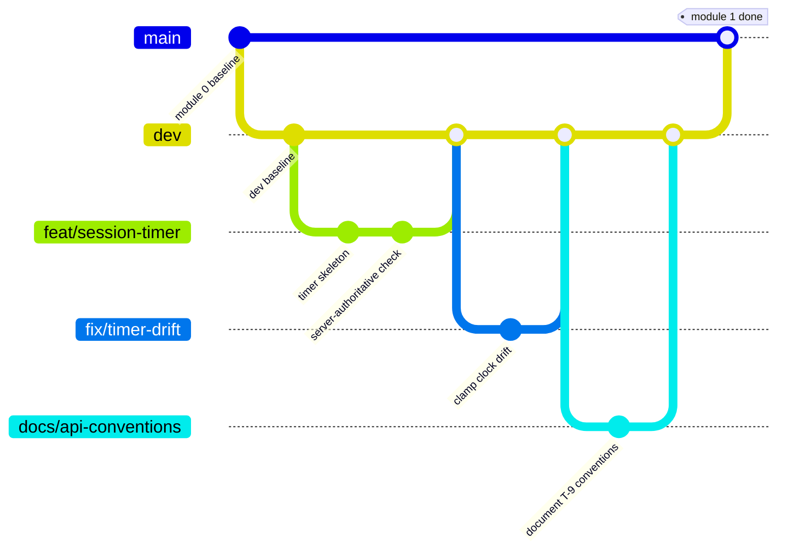

# 06 — Git Workflow & Collaboration Guide

This doc explains how the team moves code from an idea to `main`. It's written for every collaborator — read it before your first branch, and re-read it if the flow ever feels ambiguous mid-PR.

It complements, rather than replaces, the process items already open in [05 — Planning Checklist](05-planning-checklist.md) (see **T-1** through **Q-3**). Once the team settles repo strategy, CI provider, and review rules for real, update *this* doc in the same PR — per the README's own convention.

---

## 1. Branch model

Three tiers, each with a different purpose and a different amount of ceremony:

| Branch | Role | Protected? | Who merges into it |
|---|---|---|---|
| `main` | Always deployable. Reflects a finished, reviewed development module. | Yes — enforced ruleset | Only via reviewed PR from `dev` |
| `dev` | Integration branch for the module currently in progress. | Yes — lighter ruleset | Only via reviewed PR from `<type>/*` branches |
| `<type>/*` | Where actual work happens. Short-lived, one topic each. | No | N/A — this *is* the working branch |



### Branch naming: `<type>/<short-description>`

| Type | Use for | Example |
|---|---|---|
| `feat` | A new feature or capability | `feat/coop-room-lobby` |
| `fix` | A bug fix | `fix/streak-timezone-bug` |
| `docs` | Documentation-only changes | `docs/update-domain-model` |
| `refactor` | Restructuring code with no behaviour change | `refactor/extract-derive-stage` |
| `test` | Adding or fixing tests only | `test/xp-ledger-integration` |
| `chore` | Tooling, deps, config, CI | `chore/setup-flyway` |
| `style` | Formatting only, no logic change | `style/lint-frontend` |

Keep the description short, kebab-case, and specific enough that a teammate can guess the contents from the name alone. If the team starts using an issue tracker (**Q-3**), prefix with the ticket number: `feat/42-coop-room-lobby`.

---

## 2. Branch protection rulesets

Set these up in GitHub repo settings → Rules → Rulesets, for both `main` and `dev`.

**`main`** — the strict ruleset:
- Require a pull request before merging. No direct pushes, including from admins.
- Require at least one approving review (raise to two if the team is large enough to support it).
- Require status checks to pass — CI must be green (see §5).
- Require branches to be up to date before merging.
- Block force pushes and branch deletion.
- Optionally: require linear history, so `main`'s log reads as one module per merge, not a tangle.

**`dev`** — a lighter version of the same idea:
- Require a pull request before merging into it (no one pushes directly, even to fix something small — that's what `fix/*` is for).
- Require at least one approving review.
- Require CI to pass.
- Force pushes and deletion can stay blocked here too — there's rarely a good reason to rewrite `dev` history.

The point of protecting `dev` as well as `main` is that a bad merge into `dev` still blocks everyone else building on top of it for the rest of the module. Protection isn't just for the branch that ships — it's for the branch other people's work depends on.

---

## 3. The development cycle, step by step

1. **Pick up a piece of work.** Ideally it maps to an item in doc 05 or a tracked issue (**Q-3**).
2. **Branch off `dev`**, never off `main`:
   ```bash
   git checkout dev
   git pull origin dev
   git checkout -b feat/short-description
   ```
3. **Work on the branch.** Commit early and often, using Conventional Commits (§4). Push regularly so teammates can see progress and so you don't lose work.
4. **Keep the branch current.** If `dev` moves while you're working, rebase (or merge) it in before opening a PR, so review happens against a clean diff:
   ```bash
   git fetch origin
   git rebase origin/dev
   ```
5. **Open a PR into `dev`**, not `main`. Fill in the description (§5), link any related checklist item or issue.
6. **Review and iterate.** At least one teammate reviews; address comments as new commits (don't force-push mid-review — it hides what changed since the last look).
7. **Merge and delete the branch.** Squash-merge is recommended here only if the PR have several minor commits, so `dev`'s history reads as one commit per feature rather than every intermediate "wip" commit. If it's not the case, proceed with the traditional Merge Commit.
8. **Repeat 2–7** for every feature, fix, and doc change that belongs to the current development module.
9. **When the module is complete**, open a PR from `dev` into `main`. This is the higher-stakes review — treat it as a checkpoint, not a formality: does the module actually work end-to-end, are docs updated, does the checklist reflect reality?
10. **Merge into `main`** once approved and CI is green. Optionally tag the merge commit (`v0.1.0`, `v0.2.0`, ...) so the module boundary is visible in the repo's history, not just in memory.

---

## 4. Commit messages — Conventional Commits

Format:

```
<type>(<scope>): <short summary>

<optional longer body — the "why", not just the "what">
```

Use the same `<type>` vocabulary as the branch prefixes above (`feat`, `fix`, `docs`, `refactor`, `test`, `chore`, `style`). Scope should usually match a backend module from doc 02 (`identity`, `timer`, `progression`, `rooms`, `social`, `annotations`, `notifications`, `media`, `cosmetics`) or a frontend feature area.

Examples, grounded in this project's own domain:

```
feat(timer): add server-authoritative completion check (AD-2)

fix(progression): correct XP formula rounding for co-op bonus

docs(domain-model): resolve D-8 — annotations are row-level private

refactor(frontend): extract deriveStage into its own pure module

test(progression): add boundary tests for stage thresholds (0.199 vs 0.200)

chore(ci): add Testcontainers step to backend pipeline
```

A good description explains *why* a change was made when that's not obvious from the diff — "fix off-by-one" is fine for a typo; "fix streak reset at midnight because D-7 requires local-day evaluation" is much more useful six months from now.

---

## 5. Pull request guidelines

Every PR — into `dev` or into `main` — should answer, either in the description or by being self-evident from the diff:

- **What** does this change, in one or two sentences?
- **Why** — what problem or checklist item does it address?
- **How was it tested?** Unit tests, manual steps, or both.
- **Does it touch a decision recorded in the docs?** If so, which doc, and is the doc updated in this same PR?

A minimal PR template (`.github/PULL_REQUEST_TEMPLATE.md`) helps this happen automatically rather than depending on memory — worth setting up early.

---

## 6. CI pipeline expectations

The specifics are yours to build, but at minimum, CI running on every PR into `dev` and `main` should:

- Build the backend and frontend (a broken build should never be mergeable).
- Run backend unit tests, and — once **T-4**/**Q-4** are settled — integration tests against a real Postgres via Testcontainers.
- Run frontend unit tests for anything with real logic (`deriveStage` is the obvious first candidate).
- Lint both codebases.

CI passing is a **required status check** on both protected branches (§2) — a green checkmark is a gate, not a suggestion.

---

## 7. Good practices

- **Write Conventional Commits with a real description.** Future-you and your teammates are the audience, not just the compiler.
- **Update the docs in the same PR as the change**, whenever the change is a decision, not just an implementation detail. If you resolve a checklist item (05), touch a data flow (02), or change a domain rule (03), the doc should say so by the time the PR merges — not "later."
- **Use AI to help write tests.** Asking an assistant to draft unit tests for `deriveStage`'s boundaries, or for the XP ledger's edge cases, is a good use of the tool and a good habit for coverage you might otherwise skip.
- **Be deliberate about how much AI writes for you.** This project exists so the team learns to build and reason about a full-stack application — the architecture decisions, the schema trade-offs, the "why does this bug happen" moments. Leaning on AI to generate large chunks of unreviewed code trades that learning away for short-term velocity. Use it to explain, to review, to test, to unblock — and make sure you can explain, unprompted, what your own code does and why it's shaped that way.

---

## Quick reference

```bash
# Start new work
git checkout dev && git pull origin dev
git checkout -b feat/my-feature

# Stay current with dev mid-branch
git fetch origin && git rebase origin/dev

# Commit
git commit -m "feat(timer): add pause tolerance window (D-2)"

# Push and open a PR into dev via GitHub

# After merge, clean up locally
git checkout dev && git pull origin dev
git branch -d feat/my-feature
```
