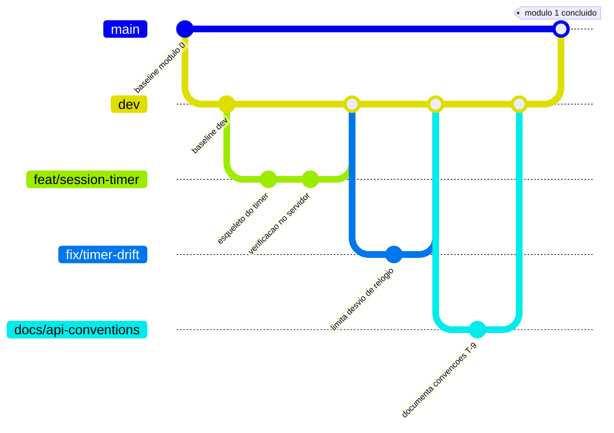

# 06 — Fluxo de Git & Guia de Colaboração

Este documento explica como o time leva código de uma ideia até a `main`. Foi escrito para todo colaborador — leia antes da sua primeira branch, e releia se o fluxo parecer ambíguo no meio de um PR.

Ele complementa, em vez de substituir, os itens de processo já em aberto no [05 — Checklist de Planejamento](05-planning-checklist.md) (veja de **T-1** a **Q-3**). Assim que o time definir de fato a estratégia de repositório, o provedor de CI e as regras de review, atualize *este* documento no mesmo PR — conforme a própria convenção do README.

---

## 1. Modelo de branches

Três níveis, cada um com um propósito diferente e uma quantidade diferente de cerimônia:

| Branch | Papel | Protegida? | Quem faz merge nela |
|---|---|---|---|
| `main` | Sempre implantável. Reflete um módulo de desenvolvimento finalizado e revisado. | Sim — ruleset rígido | Apenas via PR revisado a partir de `dev` |
| `dev` | Branch de integração do módulo atualmente em andamento. | Sim — ruleset mais leve | Apenas via PR revisado a partir de branches `<tipo>/*` |
| `<tipo>/*` | Onde o trabalho de fato acontece. Curta duração, um tópico cada. | Não | N/A — esta *é* a branch de trabalho |



### Nomenclatura de branch: `<tipo>/<descricao-curta>`

| Tipo | Usar para | Exemplo |
|---|---|---|
| `feat` | Uma nova feature ou capacidade | `feat/coop-room-lobby` |
| `fix` | Correção de bug | `fix/streak-timezone-bug` |
| `docs` | Mudanças apenas de documentação | `docs/update-domain-model` |
| `refactor` | Reestruturação de código sem mudança de comportamento | `refactor/extract-derive-stage` |
| `test` | Adicionar ou corrigir apenas testes | `test/xp-ledger-integration` |
| `chore` | Ferramental, dependências, config, CI | `chore/setup-flyway` |
| `style` | Apenas formatação, sem mudança de lógica | `style/lint-frontend` |

Mantenha a descrição curta, em kebab-case, e específica o bastante para que um colega consiga adivinhar o conteúdo só pelo nome. Se o time começar a usar um rastreador de issues (**Q-3**), prefixe com o número do ticket: `feat/42-coop-room-lobby`.

---

## 2. Rulesets de proteção de branch

Configure isso em GitHub repo settings → Rules → Rulesets, tanto para `main` quanto para `dev`.

**`main`** — o ruleset rígido:
- Exigir um pull request antes do merge. Sem pushes diretos, inclusive de admins.
- Exigir ao menos uma aprovação em review (suba para duas se o time for grande o suficiente para sustentar isso).
- Exigir que os status checks passem — a CI precisa estar verde (veja §5).
- Exigir que as branches estejam atualizadas antes do merge.
- Bloquear force pushes e exclusão da branch.
- Opcionalmente: exigir histórico linear, para que o log da `main` se leia como um módulo por merge, e não como um emaranhado.

**`dev`** — uma versão mais leve da mesma ideia:
- Exigir um pull request antes do merge (ninguém dá push direto, nem para consertar algo pequeno — é para isso que existe `fix/*`).
- Exigir ao menos uma aprovação em review.
- Exigir CI verde.
- Force pushes e exclusão podem continuar bloqueados aqui também — raramente há um bom motivo para reescrever o histórico da `dev`.

O objetivo de proteger a `dev` além da `main` é que um merge ruim na `dev` ainda trava todo mundo que está construindo em cima dela pelo resto do módulo. Proteção não é só para a branch que vai para produção — é para a branch da qual o trabalho dos outros depende.

---

## 3. O ciclo de desenvolvimento, passo a passo

1. **Pegue um pedaço de trabalho.** O ideal é que ele corresponda a um item do doc 05 ou a uma issue rastreada (**Q-3**).
2. **Crie a branch a partir de `dev`**, nunca de `main`:
   ```bash
   git checkout dev
   git pull origin dev
   git checkout -b feat/descricao-curta
   ```
3. **Trabalhe na branch.** Faça commits cedo e com frequência, usando Conventional Commits (§4). Dê push regularmente para que os colegas vejam o progresso e para que você não perca trabalho.
4. **Mantenha a branch atualizada.** Se a `dev` andar enquanto você trabalha, faça rebase (ou merge) dela antes de abrir o PR, para que o review aconteça sobre um diff limpo:
   ```bash
   git fetch origin
   git rebase origin/dev
   ```
5. **Abra um PR para `dev`**, não para `main`. Preencha a descrição (§5), vincule o item do checklist ou a issue relacionada.
6. **Revise e itere.** Ao menos um colega revisa; responda aos comentários com novos commits (não faça force-push no meio do review — isso esconde o que mudou desde a última olhada).
7. **Faça o merge e apague a branch.** Squash-merge é recomendado aqui apenas se o PR tiver vários commits menores, para que o histórico da `dev` se leia como um commit por feature em vez de cada "wip" intermediário. Se não for o caso, siga com o Merge Commit tradicional.
8. **Repita de 2 a 7** para cada feature, correção e mudança de documentação que pertença ao módulo de desenvolvimento atual.
9. **Quando o módulo estiver completo**, abra um PR de `dev` para `main`. Este é o review de maior peso — trate-o como um checkpoint, não como formalidade: o módulo realmente funciona ponta a ponta, a documentação está atualizada, o checklist reflete a realidade?
10. **Faça o merge na `main`** assim que aprovado e com a CI verde. Opcionalmente marque o commit de merge com uma tag (`v0.1.0`, `v0.2.0`, ...) para que a fronteira do módulo fique visível no histórico do repositório, e não apenas na memória.

---

## 4. Mensagens de commit — Conventional Commits

Formato:

```
<tipo>(<escopo>): <resumo curto>

<corpo opcional mais longo — o "porquê", não só o "o quê">
```

Use o mesmo vocabulário de `<tipo>` dos prefixos de branch acima (`feat`, `fix`, `docs`, `refactor`, `test`, `chore`, `style`). O escopo geralmente deve corresponder a um módulo de backend do doc 02 (`identity`, `timer`, `progression`, `rooms`, `social`, `annotations`, `notifications`, `media`, `cosmetics`) ou a uma área de feature do frontend.

Exemplos, ancorados no domínio deste próprio projeto:

```
feat(timer): add server-authoritative completion check (AD-2)

fix(progression): correct XP formula rounding for co-op bonus

docs(domain-model): resolve D-8 — annotations are row-level private

refactor(frontend): extract deriveStage into its own pure module

test(progression): add boundary tests for stage thresholds (0.199 vs 0.200)

chore(ci): add Testcontainers step to backend pipeline
```

Uma boa descrição explica *por que* uma mudança foi feita, quando isso não é óbvio pelo diff — "corrige off-by-one" está ótimo para um erro de digitação; "corrige o reset de streak à meia-noite porque D-7 exige avaliação no dia local" é muito mais útil daqui a seis meses.

> **Nota sobre idioma:** os exemplos acima estão em inglês porque é assim que eles aparecem no repositório hoje. Se o time preferir commits em português, essa é uma decisão válida — mas escolham um idioma e o mantenham, porque um histórico misturado é mais difícil de escanear do que qualquer um dos dois sozinho. O que não deve ser traduzido em nenhum caso são os `<tipo>` (`feat`, `fix`, ...), os escopos de módulo e os IDs de checklist, porque ferramentas e referências cruzadas dependem deles.

---

## 5. Diretrizes de pull request

Todo PR — para `dev` ou para `main` — deve responder, seja na descrição ou por ser evidente pelo diff:

- **O quê** isso muda, em uma ou duas frases?
- **Por quê** — qual problema ou item de checklist isso endereça?
- **Como foi testado?** Testes unitários, passos manuais, ou ambos.
- **Toca alguma decisão registrada na documentação?** Se sim, qual documento, e ele está atualizado neste mesmo PR?

Um template mínimo de PR (`.github/PULL_REQUEST_TEMPLATE.md`) ajuda isso a acontecer automaticamente em vez de depender da memória — vale configurar cedo.

---

## 6. Expectativas do pipeline de CI

As especificidades são de vocês, mas, no mínimo, a CI rodando em todo PR para `dev` e `main` deve:

- Compilar backend e frontend (um build quebrado nunca deveria ser mergeável).
- Rodar os testes unitários do backend e — assim que **T-4**/**Q-4** estiverem definidos — testes de integração contra um Postgres real via Testcontainers.
- Rodar os testes unitários do frontend para qualquer coisa com lógica real (`deriveStage` é o candidato óbvio).
- Rodar lint nas duas bases de código.

Passar na CI é um **status check obrigatório** nas duas branches protegidas (§2) — o sinal verde é um portão, não uma sugestão.

---

## 7. Boas práticas

- **Escreva Conventional Commits com uma descrição de verdade.** O público é o seu eu futuro e seus colegas, não o compilador.
- **Atualize a documentação no mesmo PR da mudança**, sempre que a mudança for uma decisão, e não apenas um detalhe de implementação. Se você resolver um item do checklist (05), mexer em um fluxo de dados (02) ou mudar uma regra de domínio (03), o documento deve dizer isso até o PR ser mergeado — não "depois".
- **Use IA para ajudar a escrever testes.** Pedir a um assistente que rascunhe testes unitários para as fronteiras do `deriveStage`, ou para os casos extremos do ledger de XP, é um bom uso da ferramenta e um bom hábito para cobertura que de outra forma seria pulada.
- **Seja deliberado sobre o quanto a IA escreve por você.** Este projeto existe para que o time aprenda a construir e raciocinar sobre uma aplicação full-stack — as decisões de arquitetura, os trade-offs de schema, os momentos de "por que esse bug acontece". Apoiar-se em IA para gerar grandes blocos de código não revisado troca esse aprendizado por velocidade de curto prazo. Use para explicar, para revisar, para testar, para destravar — e garanta que você consegue explicar, sem ser perguntado, o que o seu próprio código faz e por que ele tem a forma que tem.

---

## Referência rápida

```bash
# Começar um trabalho novo
git checkout dev && git pull origin dev
git checkout -b feat/minha-feature

# Manter-se atualizado com a dev no meio da branch
git fetch origin && git rebase origin/dev

# Commit
git commit -m "feat(timer): add pause tolerance window (D-2)"

# Push e abrir um PR para dev via GitHub

# Depois do merge, limpar localmente
git checkout dev && git pull origin dev
git branch -d feat/minha-feature
```
