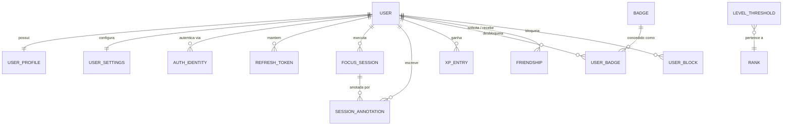

# 08 — Inventário de Entidades por Escopo

Insumo direto para a sessão de modelagem ER. O [doc 03](03-domain-model.md) traz o mapa candidato e o *raciocínio* por trás de cada entidade; este documento faz o recorte: **o que vira migration agora, o que fica só no diagrama, e o que pode nunca existir.**

Leia o doc 03 antes deste. Não repito aqui as justificativas de design que já estão lá.

---

## Decisões tomadas nesta sessão

Quatro decisões foram fechadas e são a base de todo o recorte abaixo. Elas resolvem ou informam itens do [checklist](05-planning-checklist.md).

| Decisão | Resultado | Afeta |
|---|---|---|
| Limite de MVP | Confirmado exatamente como está no doc 01 | **P-1** — resolvido |
| Catálogos de gamificação | Dado no banco, não código fixo | **D-6**, pergunta 3 do doc 03 |
| Estratégia de token | JWT + refresh token persistido | **A-1** — resolvido |
| Estratégia de recorte | Corte por feature, com colunas-âncora antecipadas | — |

Uma quinta decisão veio do contexto do projeto: **isto é um trabalho de disciplina, sem deploy público previsto.** Consequências diretas:

- **P-7** fica resolvido como "restrito a colegas de turma". Abuso, moderação e escala deixam de ser escopo.
- **L-2**, **L-6** e **L-7** (LGPD/GDPR, termos de uso, banner de consentimento) ficam fora enquanto não houver usuários reais.
- **A-6** (anti-cheat) é explicitamente baixo esforço. A validação no servidor de **AD-2** continua valendo porque é barata e é aprendizado de arquitetura, não porque alguém vai trapacear.
- **T-6** (hospedagem) deixa de ser bloqueante.

Se o projeto for publicado depois, estas quatro voltam para a mesa antes do lançamento.

---

## Legenda de escopo

Três categorias, e a distinção entre a segunda e a terceira importa:

| Marca | Significado |
|---|---|
| **MVP** | Vira migration agora. 14 tabelas. |
| **Pós-MVP** | Vai existir, mas depois. Desenhada no diagrama, sem DDL. |
| **Condicional** | Só existe se uma decisão específica cair de um lado. Pode nunca ser criada. |

"Pós-MVP" e "condicional" são coisas diferentes e o diagrama do doc 03 não separa as duas. Cerca de um terço das tabelas fora do MVP é condicional.

---

## Mapa MVP — 14 tabelas

`LEVEL_THRESHOLD` e `RANK` são catálogos sem FK para usuário. O nível de um usuário é derivado da soma do `XP_ENTRY` comparada contra `LEVEL_THRESHOLD`; o rank é derivado do nível. Nada disso é armazenado como verdade — conforme **AD-6**.

### `identity` — 5 tabelas

#### `USER`
Identidade e ciclo de vida, nada mais. `id` BIGINT interno, `public_id` UUID para exposição, `email` único, `status`, `created_at`, `deleted_at`.

É a **única tabela com soft delete** (conforme doc 03). Não tem coluna de senha: o hash vive em `AUTH_IDENTITY`.

> **Nota:** sem verificação de e-mail no MVP, `USER.email` é um dado não confiável. Nada pode depender dele — em particular, não implemente busca de amigos por e-mail até que **A-2** seja resolvido.

#### `AUTH_IDENTITY`
Uma linha por método de login. `provider` (`LOCAL` / `GOOGLE` / ...), `provider_subject`, `password_hash` preenchido apenas quando `provider = LOCAL`. Índice único em (`provider`, `provider_subject`).

Adicionar login social depois é inserir linhas, não reestruturar tabela.

#### `USER_PROFILE`
Questões de exibição: `display_name`, `avatar_seed` (iniciais geradas — ver **F-13**), `bio`, e **`timezone`** (IANA).

O campo `timezone` é o insumo de **D-7**. Sem ele, não existe streak correto. Vale tratá-lo como obrigatório desde o cadastro, não como campo opcional de perfil.

Cache opcional de `total_xp` e `current_level` para performance de leitura. O ledger continua sendo a verdade.

#### `USER_SETTINGS`
`default_focus_seconds`, `default_break_seconds`, `auto_start_break`, `sound_enabled`.

**Âncora:** `theme_id` anulável, apontando para a futura `COSMETIC_ITEM`. No MVP a coluna existe e é sempre nula.

#### `REFRESH_TOKEN`
`token_hash` (nunca o token em claro), `expires_at`, `revoked_at`, `user_agent`, `created_at`.

Guardar o hash é a mesma disciplina de uma senha: se o banco vazar, os tokens não são reutilizáveis.

### `timer` — 1 tabela

#### `FOCUS_SESSION`
A tabela central. Tudo o mais é configuração para ela ou consequência dela.

| Campo | Notas |
|---|---|
| `type` | `FOCUS` / `SHORT_BREAK` / `LONG_BREAK` — pausas moram aqui mesmo |
| `status` | `RUNNING` / `PAUSED` / `COMPLETED` / `ABANDONED` — linha criada no início (**AD-3**) |
| `planned_duration_seconds` | Dirige o ciclo da estrela e a verificação de conclusão |
| `actual_focus_seconds` | Planejado menos pausa; dirige estatística honesta |
| `paused_total_seconds` | Acumulado, sem tabela de intervalos |
| `started_at` / `ended_at` | `timestamptz`, sempre UTC |
| `room_id` | **Âncora.** Anulável, sempre nulo no MVP |

`TIMER_PRESET` foi cortada. `USER_SETTINGS` já guarda a duração padrão; presets nomeados são conveniência que ninguém pediu ainda. Está listada em pós-MVP.

### `annotations` — 1 tabela

#### `SESSION_ANNOTATION`
`user_id` (obrigatório), `session_id` (**anulável**), `note_date`, `body`, `created_at`, `updated_at`.

O `session_id` anulável mais `note_date` cobre nota-de-sessão e nota-de-dia numa tabela só. O `user_id` é obrigatório justamente porque a nota pode não ter sessão.

**Âncora:** `visibility` com default `PRIVATE`.

> **Bloqueado parcialmente por D-8.** O desenho acima assume a leitura 1 do doc 03 — *privada* = não compartilhada, autorização a nível de linha. Se a resposta for "criptografada contra os operadores", esta tabela muda de forma e a recuperação de senha passa a ser destrutiva. Confirme antes da migration.

### `progression` — 5 tabelas

#### `XP_ENTRY`
Ledger append-only (**AD-6**). `user_id`, `amount`, `source_type` (`SESSION_COMPLETED` / `STREAK_BONUS` / `BADGE_UNLOCKED`), `source_id`, `awarded_at`.

`COOP_BONUS` fica de fora do CHECK constraint por enquanto — entra quando salas existirem.

#### `LEVEL_THRESHOLD`
`level`, `xp_required`, `rank_id`. A curva de níveis como dado (**D-6**).

#### `RANK`
`code`, `name` ("Stellar Cartographer", "Quasar"), `min_level`, definição visual.

#### `BADGE`
Catálogo: `code`, `name`, `description`, `icon`, `criteria_type`, `criteria_json`, `target_count`.

Critério híbrido conforme doc 03: `criteria_json` cobre os badges de contagem ("faça X, N vezes"), e badges exóticos como "Night Watch" ficam em código referenciados por `criteria_type`. **Não construam o avaliador genérico antes de ter três badges que o usem.**

#### `USER_BADGE`
`user_id`, `badge_id`, `unlocked_at` (anulável), `progress_count`. A linha existe desde o primeiro progresso, não desde o desbloqueio — é o que permite renderizar "Deep Field · 12 / 25".

### `social` — 2 tabelas

#### `FRIENDSHIP`
`requester_id`, `addressee_id`, `status`, `requested_at`, `responded_at`. Linha direcional, leitura simétrica.

Duas constraints obrigatórias: índice único no par ordenado, e `CHECK (requester_id <> addressee_id)`.

#### `USER_BLOCK`
Tabela separada de propósito. Um bloqueio precisa sobreviver à amizade ser apagada — se `BLOCKED` fosse um status em `FRIENDSHIP`, deletar a amizade desfaria o bloqueio.

---

## As três âncoras

Colunas criadas agora, sempre nulas no MVP, que evitam `ALTER TABLE` numa tabela com dados de usuário depois.

| Tabela | Coluna | Destrava |
|---|---|---|
| `FOCUS_SESSION` | `room_id` | Salas co-op |
| `SESSION_ANNOTATION` | `visibility` | Notas compartilhadas (leitura 3 de **D-8**) |
| `USER_SETTINGS` | `theme_id` | Cosméticos |

Três colunas mortas. O custo é aproximadamente zero e a alternativa é alterar `FOCUS_SESSION` — a tabela mais quente do schema — depois que ela acumulou histórico.

As FKs correspondentes (`ROOM`, `COSMETIC_ITEM`) não existem ainda, então as colunas entram sem constraint de FK e ganham a constraint na migration que cria a tabela alvo.

---

## Mapa completo — MVP + futuro

```mermaid
erDiagram
    USER ||--|| USER_PROFILE : "possui"
    USER ||--|| USER_SETTINGS : "configura"
    USER ||--o{ AUTH_IDENTITY : "autentica via"
    USER ||--o{ REFRESH_TOKEN : "mantem"
    USER ||--o{ TIMER_PRESET : "define"

    USER ||--o{ FOCUS_SESSION : "executa"
    USER ||--o{ SESSION_ANNOTATION : "escreve"
    FOCUS_SESSION ||--o{ SESSION_ANNOTATION : "anotada por"
    FOCUS_SESSION }o--o| ROOM : "pode pertencer a"

    USER ||--o{ XP_ENTRY : "ganha"
    USER ||--o{ USER_BADGE : "desbloqueia"
    BADGE ||--o{ USER_BADGE : "concedido como"
    LEVEL_THRESHOLD }o--|| RANK : "pertence a"

    USER ||--o{ USER_TRACK_PROGRESS : "avanca em"
    PROGRESSION_TRACK ||--o{ USER_TRACK_PROGRESS : "medida por"
    CONSTELLATION ||--o{ CONSTELLATION_MEMBER : "agrupa"
    BADGE ||--o{ CONSTELLATION_MEMBER : "participa de"

    USER ||--o{ FRIENDSHIP : "solicita / recebe"
    USER ||--o{ USER_BLOCK : "bloqueia"
    USER ||--o{ LEADERBOARD_SNAPSHOT : "aparece em"

    USER ||--o{ ROOM : "hospeda"
    ROOM ||--o{ ROOM_MEMBERSHIP : "contem"
    USER ||--o{ ROOM_MEMBERSHIP : "entra em"
    ROOM ||--o{ ROOM_CYCLE : "executa"
    ROOM ||--o{ ROOM_MESSAGE : "registra"

    USER ||--o{ REMINDER : "agenda"
    USER ||--o{ NOTIFICATION : "recebe"
    USER ||--o{ PUSH_SUBSCRIPTION : "registra"
    USER ||--o{ NOTIFICATION_PREFERENCE : "ajusta"

    USER ||--o{ USER_UNLOCK : "possui"
    COSMETIC_ITEM ||--o{ USER_UNLOCK : "desbloqueado como"
    USER_SETTINGS }o--o| COSMETIC_ITEM : "equipa"
    USER ||--o| MUSIC_LINK : "conecta"
```

`AMBIENCE_TRACK` e `USER_PRESENCE` não aparecem no diagrama porque a recomendação é que não existam — ver abaixo.

---

## Escopo pós-MVP

### `rooms` — bloqueado, não apenas adiado

**Nenhuma destas tabelas deve ser desenhada em detalhe até que R-1 a R-5 estejam respondidas.** As respostas mudam o formato, não só o conteúdo.

| Tabela | Escopo | Notas |
|---|---|---|
| `ROOM` | Pós-MVP | host, nome, status `LOBBY`/`ACTIVE`/`CLOSED`, capacidade, mecanismo de convite |
| `ROOM_MEMBERSHIP` | Pós-MVP | `joined_at`, `left_at`, papel |
| `ROOM_CYCLE` | **Condicional a R-1** | Só existe se o modelo for *timer compartilhado*. Se forem timers paralelos com presença, cada membro tem sua `FOCUS_SESSION` e esta tabela nunca nasce. |
| `ROOM_MESSAGE` | **Condicional a R-7** | Só se houver chat. Traz junto moderação, retenção e denúncia — escopo que hoje não está contabilizado em lugar nenhum. |

A diferença entre as duas leituras de **R-1** é uma ordem de grandeza de custo, e hoje as duas se chamam "sala co-op". Resolvam isso antes de qualquer estimativa.

### `progression` estendida

| Tabela | Escopo | Notas |
|---|---|---|
| `PROGRESSION_TRACK` | Pós-MVP | Catálogo de trilhas, com coluna `period` (`LIFETIME` / `WEEKLY`) |
| `USER_TRACK_PROGRESS` | **Condicional** | Só para trilhas `LIFETIME`. Trilha semanal é `COUNT(*)` com filtro de data sobre `FOCUS_SESSION` — calcular na leitura é mais simples e correto nesta escala |
| `CONSTELLATION` | **Condicional a D-11** | "Constelação" ainda não tem definição |
| `CONSTELLATION_MEMBER` | **Condicional a D-11** | Aponta para `BADGE` ou para `PROGRESSION_TRACK` dependendo da resposta. Desenhei como badge no diagrama, mas é um chute |

### `cosmetics`

`COSMETIC_ITEM` (tipo, regra de desbloqueio, definição visual) e `USER_UNLOCK` (quem desbloqueou o quê, quando). O item atualmente equipado já tem âncora em `USER_SETTINGS.theme_id` — não precisa de tabela própria.

### `social` estendida

| Tabela | Escopo | Notas |
|---|---|---|
| `LEADERBOARD_SNAPSHOT` | **Condicional a D-10** | Só faz sentido se o ranking for periódico com histórico preservado. Se for vitalício, é uma agregação sobre `XP_ENTRY` e a tabela não existe |
| `USER_PRESENCE` | **Não recomendada** | Presença é estado efêmero de segundos. Escrever isso no Postgres a cada heartbeat é exatamente a carga que o doc 02 aponta como justificativa para Redis (**T-13**). Mantenha em memória |

### `notifications`

| Tabela | Escopo | Notas |
|---|---|---|
| `REMINDER` | Pós-MVP | O que o usuário agendou |
| `NOTIFICATION` | Pós-MVP | O que foi efetivamente entregue |
| `PUSH_SUBSCRIPTION` | **Condicional a N-1** | Endpoint + chaves. Só se Web Push entrar |
| `NOTIFICATION_PREFERENCE` | **Condicional a N-5** | Se a granularidade for por tipo. Se for um interruptor global, viram colunas em `USER_SETTINGS` |

### `media` — bloqueado por L-1

| Tabela | Escopo | Notas |
|---|---|---|
| `MUSIC_LINK` | **Condicional a L-1** | Guarda o refresh token OAuth do provedor. É a tabela mais sensível do schema depois das credenciais: criptografe a coluna em repouso, nunca logue, nunca retorne ao cliente |
| `AMBIENCE_TRACK` | **Condicional a L-1** | Só existe se a resposta for loops próprios licenciados |

Ambas podem desaparecer inteiras dependendo de **L-1**, que é uma questão jurídica e não técnica.

### `timer` estendida

`TIMER_PRESET` — pós-MVP. Durações nomeadas e reutilizáveis, se alguém pedir.

### `identity` estendida

`EMAIL_VERIFICATION_TOKEN` e `PASSWORD_RESET_TOKEN` — cortadas do MVP por decisão explícita (projeto de disciplina, sem deploy).

**São pré-requisito de qualquer lançamento real.** Sem reset de senha, quem esquece a senha perde a conta. Se o projeto sair da sala de aula, estas duas voltam antes de qualquer outra coisa. Considerem fundir numa `ONE_TIME_TOKEN` com coluna `purpose` quando chegar a hora — duas tabelas são mais explícitas e permitem políticas de expiração diferentes, uma é menos repetição; não tenho preferência forte.

---

## O que ainda bloqueia o DDL

O recorte está fechado, mas cinco decisões viram **colunas e constraints**, não tabelas — e a primeira migration não fecha sem elas. Levem todas para a mesma reunião da ER:

| Item | O que trava |
|---|---|
| **D-1** | O que conta como ciclo concluído. Define a regra de transição para `status = COMPLETED` |
| **D-2** | Semântica da pausa. Define se `paused_total_seconds` tem teto e se conta para "in orbit" |
| **D-3** | Tolerância de relógio. Precisa de um número, não de um conceito |
| **D-5** | Fórmula de XP. Escrevam antes de criar `XP_ENTRY` — o ledger é só útil se o `amount` for reproduzível |
| **D-7** | Definição de streak e fuso. Depende de `USER_PROFILE.timezone` |

### A tabela que não existe

Não há tabela de streak — e isso é deliberado. A *orbit* é calculada na leitura a partir de `FOCUS_SESSION`, agrupando por dia local do usuário.

Isso é correto no MVP e evita um job de reset e uma fonte de verdade duplicada. Fica caro apenas se o streak virar critério de ranking com histórico. **Registre a decisão explicitamente** em vez de descobri-la por ausência seis meses depois.

---

## Convenções

Valem as do [doc 03](03-domain-model.md) sem alteração: `BIGINT GENERATED ALWAYS AS IDENTITY` mais `UUID` público nas entidades expostas, `timestamptz` sempre em UTC, `VARCHAR` + `CHECK` em vez de `ENUM` do Postgres, soft delete apenas em `USER`, `snake_case` com tabelas no plural, durações em segundos como `INTEGER`.

Os índices de partida também estão no doc 03. Criem cada um quando a query correspondente existir, e meçam com `EXPLAIN ANALYZE` em vez de supor.

---

## Perguntas para a sessão de ER

As do doc 03 que continuam abertas, mais as que este recorte levantou:

1. **D-8** — a leitura 1 ("privada = não compartilhada") está confirmada? O desenho de `SESSION_ANNOTATION` depende disso.
2. `EMAIL_VERIFICATION_TOKEN` e `PASSWORD_RESET_TOKEN` — duas tabelas ou uma `ONE_TIME_TOKEN` com `purpose`, quando entrarem?
3. `USER_PROFILE.timezone` é obrigatório no cadastro ou preenchido depois? Streak sem fuso não funciona.
4. O streak calculado na leitura é aceito como decisão permanente, ou é provisório até o ranking existir?
5. **D-10** — ranking vitalício ou periódico? Decide se `LEADERBOARD_SNAPSHOT` existe.
6. **D-11** — o que é uma constelação? Decide para onde `CONSTELLATION_MEMBER` aponta.
7. Qual a primeira migration? Sugestão: `identity` completo, para que autenticação funcione antes de qualquer coisa depender de um usuário existir.
